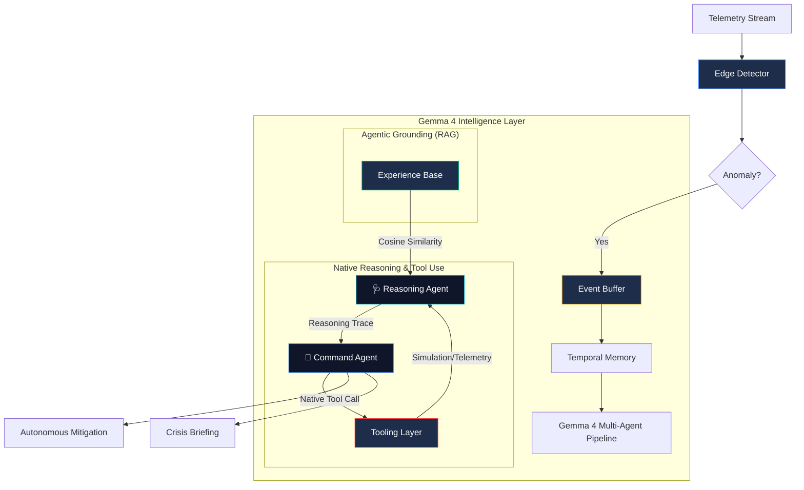

# 🛡️ NetGuardian — Edge AI for Disaster-Prone Infrastructure

> **"Resilience at the edge, even when the cloud is dark."**
>
> **Global Resilience & Infrastructure Safety** — A 100% offline, agentic defense system engineered specifically for **remote telecom networks, utility grids, and disaster-recovery zones.** Powered by **Gemma 4 Native Intelligence.**

---

## 🏗️ Judge-Winning Architecture

---

## 🚀 Key Innovations for Gemma 4

### 1. Global Resilience: Disaster-Grade Edge Intelligence
NetGuardian addresses the most critical gap in modern AI: **Cloud Dependency**. In disaster scenarios where backhaul connectivity is severed, NetGuardian provides frontier-grade intelligence locally. It turns a standard industrial gateway into an autonomous incident responder.

### 2. Safety & Trust: The Explainable Reasoning Trace
We leverage Gemma 4's superior reasoning to generate a **structured Reasoning Trace**. Instead of "black box" decisions, NetGuardian explains its logic:
*   *Step 1: Evidence gathering via `get_node_status`.*
*   *Step 2: Probabilistic modeling of cascade paths.*
*   *Step 3: Verification via `simulate_impact`.*
This transparency is critical for building trust with human operators in high-stakes infrastructure environments.

### 3. Technical Depth: Native Function Calling via Ollama
Unlike basic prompt-based JSON extraction, NetGuardian utilizes **Gemma 4's Native Function Calling** capabilities. By interfacing with the **Ollama Chat API**, our agents dynamically call tools like `simulate_impact()` as formal function objects. This ensures deterministic grounding and architectural robustness.

---

## 🧠 Multi-Agent Logic Engine

| Agent | Role | Gemma 4 Specialization |
|-------|------|-------------------------|
| 🩺 **Reasoning** | Predictive Forensic | Probabilistic hypothesis generation & cascade prediction. |
| 🔧 **Command** | Tactical Commander | Native tool invocation & trade-off analysis. |
| 📢 **Communicator** | Crisis Briefing | Multi-modal ready briefing generation (Safety & Trust). |

---

## 🛠️ Technology Stack (Special Technology Track)
- **Model**: Gemma 4 (9B/27B) — Utilized for its native tool-calling and improved reasoning density.
- **Provider**: **Ollama** — 100% local inference via `/api/chat` for maximum privacy and resilience.
- **Framework**: FastAPI (Backend) + React/Vite (Premium Dashboard).
- **Inference Strategy**: Quantized 4-bit/8-bit execution for sub-3s reasoning loops on edge hardware.

---

## 🏆 Why NetGuardian Wins
1. **Impact**: Solves the "Offline AI" problem for critical infrastructure (Global Resilience Track).
2. **Technical Mastery**: Implements Native Function Calling and Agentic Retrieval (Technical Depth Track).
3. **Storytelling**: A "WOW" factor UI that visualizes AI thought processes in real-time.
