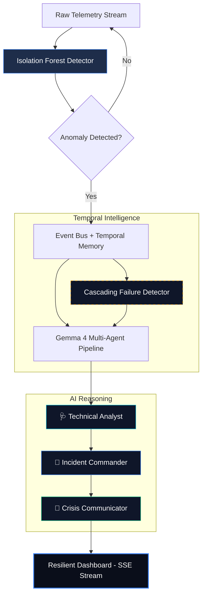

# 🛡️ NetGuardian — AI Resilience for Critical Infrastructure

> **"NetGuardian operates even when the network itself is failing."**
>
> **Disaster-Grade Incident Response** — Real-time anomaly detection powered by local, offline multi-agent AI (Gemma 4). Engineered for remote utility grids, disaster recovery zones, and critical infrastructure where cloud dependency is a liability.

---

## 🏗️ Architecture



---

## 🏆 The Winning Pitch: "Disaster-Grade Resilience"

**The Problem**: In a disaster scenario (flood, earthquake, cyber-attack), the network doesn't just "glitch"—it collapses. Cloud AI is useless when the fiber lines are cut. Humans are overwhelmed by the speed of cascading failures.

**The Solution**: **NetGuardian**. A 100% offline system that doesn't just react to spikes—it **predicts cascades**.

### The Dramatic Demo Flow:
1. **The Watchman**: Establishing a baseline in a remote power grid.
2. **The First Strike**: A minor traffic spike is detected. The system logs it.
3. **The Cascade**: Seconds later, a packet loss event occurs.
4. **The Intelligence**: NetGuardian’s **Temporal Intelligence** recognizes the pattern. It doesn't just say "latency is high"; it screams **"CASCADING FAILURE DETECTED"**.
5. **The Handoff**: The agents shift from "optimization" mode to "containment" mode, isolating the failing node before the entire grid goes dark.

---

## 🧠 WOW Feature: Temporal Pattern Recognition

Unlike standard monitors, NetGuardian analyzes **sequences, not just snapshots**. 
Our memory system correlates events over time:
- **Spike → Loss → Drop**: Triggers a **Cascading Failure Alert**.
- **Repeated Spike**: Triggers a **Persistent Incident Warning**.

This allows our agents to perform **Multi-Step Reasoning**:
1. **Classify**: Identify the technical signature.
2. **Infer**: Predict the next link in the failure chain.
3. **Remediate**: Prioritize isolation over performance.

---

## 🚀 Quick Start

### 1. Prerequisites

| Tool | Purpose |
|------|---------|
| Python 3.10+ | Backend |
| Node 18+ | Frontend |
| [Ollama](https://ollama.com) | Local Gemma AI |

### 2. Launch Stack

```powershell
# Start Backend
pip install -r requirements.txt
uvicorn backend.main:app --reload

# Start Frontend
cd frontend
npm run dev
```

---

## ⚠️ Why NetGuardian Wins

- **100% Offline**: Zero cloud dependency. Operates in isolated military, utility, and disaster zones.
- **Multi-Step Reasoning**: Agents don't just "hallucinate" answers; they follow a structured mental model (Classify → Infer → Act).
- **Schema Hardened**: Every AI output is validated against strict schemas. If the model fails, the system’s safety fallbacks take over.
- **Defense-Grade Latency**: Sub-second reasoning on consumer hardware.
