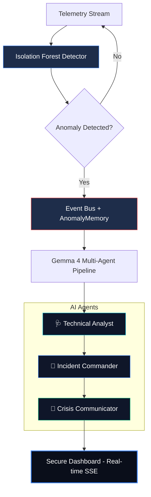

# 🛡️ NetGuardian — AI Resilience for Critical Infrastructure

> **Enterprise-Grade Incident Response** — Real-time anomaly detection powered by local, offline multi-agent AI (Gemma 4). Engineered for secure, isolated environments where cloud dependencies are a liability.

---

## 🏗️ Architecture



---

## 🏆 The Winning Pitch: "The Resilience Edge"

**The Problem**: Critical infrastructure (power grids, water systems, defense) cannot rely on cloud-based AI for incident response. Latency and data sovereignty are non-negotiable.

**The Solution**: **NetGuardian**. A 100% offline, agentic response system that lives on the edge.

### Demo Script / Talk Track:
1. **The Watchman**: "Notice the live stream. Our Isolation Forest model is establishing a baseline for 'normal'. No rules, just pure machine learning."
2. **The Breach**: "I'm injecting a scripted anomaly now. Within milliseconds, the 'Technical Analyst' agent has decoded the raw telemetry into a structured diagnosis."
3. **The Commander**: "But knowing *what* happened isn't enough. Our 'Incident Commander' has already prioritized 4 tactical remediations, while the 'Communicator' drafted an executive summary for the C-suite."
4. **The Memory**: "Look at the 'Agent Memory' footer. NetGuardian isn't just reacting; it's learning from the last 5 incidents to provide better context for the next one."

---

## 🚀 Quick Start

### 1. Prerequisites

| Tool | Purpose |
|------|---------|
| Python 3.10+ | Backend |
| Node 18+ | Frontend |
| [Ollama](https://ollama.com) | Local Gemma AI (optional — mock fallback included) |

### 2. Backend

```powershell
# Install dependencies
pip install -r requirements.txt

# Start the API server (from repo root)
uvicorn backend.main:app --reload --host 0.0.0.0 --port 8000
```

### 3. Frontend

```powershell
cd frontend
npm install
npm run dev
# Opens at http://localhost:5173
```

### 4. AI (Optional — Ollama)

```powershell
# Install Ollama from https://ollama.com, then:
ollama pull gemma3
# Ollama runs automatically at http://localhost:11434
```

> ⚡ **No Ollama? No problem.** The system includes a high-fidelity mock fallback so the demo works 100% offline without any AI setup.

---

## 📁 Project Structure

```
netguardian/
├── backend/
│   ├── main.py                   # FastAPI entrypoint
│   ├── anomaly/
│   │   ├── detector.py           # Isolation Forest
│   ├── agents/
│   │   ├── gemma_client.py       # Ollama client + Mock logic
│   │   ├── diagnosis_agent.py    # Technical Analyst Role
│   │   ├── recommendation_agent.py # Incident Commander Role
│   │   └── explanation_agent.py  # Crisis Communicator Role
│   ├── events/
│   │   └── trigger.py            # Event Bus + AnomalyMemory
│   └── api/
│       └── routes.py             # REST + SSE endpoints
├── frontend/
│   └── src/
│       ├── components/
│       │   ├── AIPanel.jsx       # Structured Multi-Agent UI
│       │   └── ...
├── requirements.txt
└── docker-compose.yml
```

---

## 🧠 AI Agent Pipeline (Structured JSON)

| Agent | Role | Output Schema |
|-------|------|---------------|
| 🩺 **Technical Analyst** | Forensic Analysis | `issue`, `root_cause`, `confidence`, `impact` |
| 🔧 **Incident Commander** | Remediations | `actions: [{action, priority, difficulty}]` |
| 📢 **Crisis Communicator** | Stakeholder Management | `summary`, `eta_guess`, `status_color` |

---

## ⚠️ Why NetGuardian Wins

- **100% Offline**: No API keys, no data leaks, no internet required.
- **Agentic Memory**: Maintains state across incidents for smarter, context-aware responses.
- **Enterprise-Grade**: Structured JSON output ensures the AI can be integrated with other automated systems (firewalls, ticket systems).
- **Sub-Second Reasoning**: Optimized for local Gemma models.
