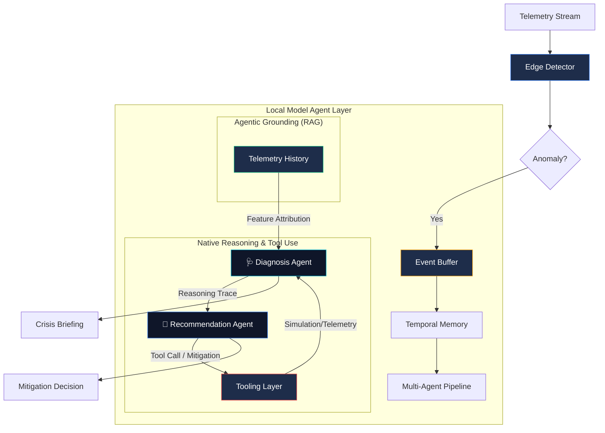

# 🛡️ NetGuardian — Local-First Edge AI for Infrastructure Anomaly Response

> **"Resilience at the edge, even when the cloud is dark."**
>
> **Global Resilience & Infrastructure Safety** — A local-first, agentic incident response system built for **remote telecom networks, utility grids, and disaster-recovery zones.** The demo uses a **local Ollama-backed language model** for grounded reasoning and falls back to deterministic responses when the model is unavailable.

NetGuardian is built to show a realistic edge-AI workflow: detect anomalies from live telemetry, simulate likely failure cascades, and generate an operator-facing briefing with grounded recommendations.

---

## 🏗️ Verified Architecture

---

## 🚀 What the Demo Proves

### 1. Local-First Resilience
The system is designed to run without a cloud round trip. In the demo, telemetry ingestion, anomaly scoring, simulation, and briefing generation happen in one local flow so the judges can see the full path from detection to action.

### 2. Explainable Incident Handling
The backend returns a structured incident object that includes the anomaly score, feature attribution, simulated cascade summary, and operator briefing. That makes the output easy to verify in both the UI and the writeup.

### 3. Agentic Tool Use
The diagnosis agent is configured with tool definitions for `simulate_impact`, `get_node_status`, and `analyze_topology`. The recommendation and explanation agents then turn the grounded result into mitigation guidance and a human-readable briefing.

---

## 🧠 Multi-Agent Logic Engine

| Agent | Role | Local Model Specialization |
|-------|------|-------------------------|
| 🩺 **Diagnosis** | Predictive Forensic | Root-cause hypotheses and validation against tool output. |
| 🔧 **Recommendation** | Tactical Commander | Chooses the lowest-disruption mitigation path. |
| 📢 **Explanation** | Crisis Briefing | Summarizes what happened, why it matters, and what was done. |

---

## 🛠️ Technology Stack (Special Technology Track)
- **Model**: local Ollama-backed language model used for operator-facing reasoning.
- **Provider**: **Ollama** — local `/api/chat` endpoint with deterministic fallback responses if the model is unavailable.
- **Framework**: FastAPI backend + React/Vite dashboard.
- **Core pipeline**: IsolationForest anomaly detection, synthetic telemetry generation, graph-based impact simulation, and agent-driven briefing output.
- **Demo focus**: fast, readable incident triage that judges can verify end to end.

---

## 🏆 Why NetGuardian Is Competitive
1. **Impact**: Addresses the resilience problem for remote infrastructure where cloud access is unreliable.
2. **Technical depth**: Combines anomaly detection, simulation, and multi-agent reasoning into one verifiable flow.
3. **Judging clarity**: The UI surfaces the anomaly, the simulated impact, and the generated operator response in one place.

## ✅ What’s Actually Implemented
- Real-time telemetry replay from a generated or loaded dataset.
- IsolationForest-based anomaly detection with feature attribution.
- Graph-based failure propagation simulation for affected nodes.
- Local model orchestration through grounded prompts and tool definitions.
- React dashboard for status, anomaly feed, charting, and agent briefing.

## Demo Notes
- The repo is intentionally demo-friendly: if Ollama is unavailable, the agent layer falls back to deterministic JSON so the interface remains usable.
- For the hackathon writeup, focus on the end-to-end flow, the agent contract, and the grounded simulation output rather than claiming full production autonomy.
