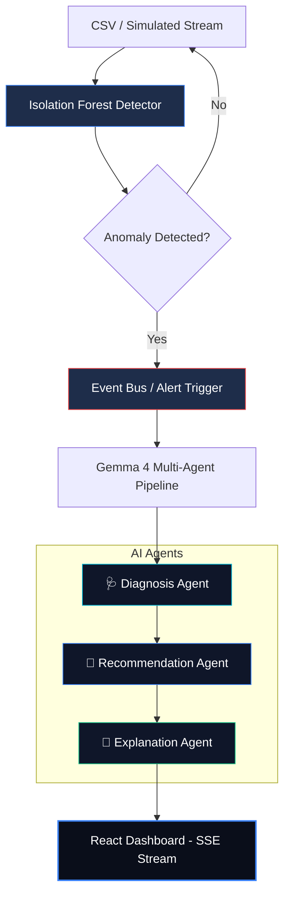

# 🛡️ NetGuardian — Offline AI Network Incident Response System

> **Demo-first hackathon build** — real-time anomaly detection + local Gemma 4 AI agents, fully offline.

---

## 🏗️ Architecture



---

## 🚀 Quick Start

### 1. Prerequisites

| Tool | Purpose |
|------|---------|
| Python 3.10+ | Backend |
| Node 18+ | Frontend |
| [Ollama](https://ollama.com) | Local Gemma AI (optional — mock fallback included) |

### 2. Backend

```powershell
# Install dependencies
pip install -r requirements.txt

# Start the API server (from repo root)
uvicorn backend.main:app --reload --host 0.0.0.0 --port 8000
```

### 3. Frontend

```powershell
cd frontend
npm install
npm run dev
# Opens at http://localhost:5173
```

### 4. AI (Optional — Ollama)

```powershell
# Install Ollama from https://ollama.com, then:
ollama pull gemma3
# Ollama runs automatically at http://localhost:11434
```

> ⚡ **No Ollama? No problem.** The system includes a realistic mock fallback so the demo works 100% offline without any AI setup.

---

## 🎬 Demo Flow

1. Open `http://localhost:5173`
2. Click **▶ Start Stream** — watch real-time metrics animate
3. Click **⚡ Inject Anomaly** — triggers the full AI pipeline
4. Watch the AI panel populate with:
   - 🩺 **Diagnosis**: root cause analysis
   - 🔧 **Recommendations**: 4 concrete actions
   - 📢 **Summary**: NOC-ready incident report

Or run the CLI demo:
```powershell
python demo/simulate_stream.py
```

---

## 📁 Project Structure

```
netguardian/
├── backend/
│   ├── main.py                   # FastAPI entrypoint
│   ├── anomaly/
│   │   ├── detector.py           # Isolation Forest
│   │   └── preprocess.py         # CSV loading + scaling
│   ├── agents/
│   │   ├── gemma_client.py       # Ollama client + mock fallback
│   │   ├── diagnosis_agent.py    # "What is happening?"
│   │   ├── recommendation_agent.py # "What should we do?"
│   │   └── explanation_agent.py  # Human-readable summary
│   ├── events/
│   │   └── trigger.py            # Event bus → agent pipeline
│   └── api/
│       └── routes.py             # REST + SSE endpoints
├── frontend/
│   └── src/
│       ├── App.jsx               # Main dashboard
│       └── components/
│           ├── MetricChart.jsx   # Real-time chart (Recharts)
│           ├── AnomalyFeed.jsx   # Live anomaly log
│           ├── AIPanel.jsx       # Gemma response display
│           └── StatusBadge.jsx   # System health indicator
├── data/
│   └── sample_network.csv        # Synthetic traffic dataset
├── demo/
│   └── simulate_stream.py        # Scripted demo runner
├── requirements.txt
└── docker-compose.yml
```

---

## 🧠 AI Agent Pipeline

| Agent | Input | Output |
|-------|-------|--------|
| 🩺 Diagnosis | Anomaly metrics | Root cause explanation |
| 🔧 Recommendation | Diagnosis + metrics | 4 actionable steps |
| 📢 Explanation | Everything | NOC-ready summary |

All agents use **Gemma 4** via Ollama with structured prompts. Falls back to realistic mock responses if Ollama is unavailable.

---

## 🔌 API Endpoints

| Method | Endpoint | Description |
|--------|----------|-------------|
| `GET` | `/api/health` | System status |
| `GET` | `/api/metrics/history` | Full dataset |
| `GET` | `/api/stream` | SSE real-time stream |
| `POST` | `/api/stream/stop` | Stop stream |
| `POST` | `/api/inject-anomaly` | Trigger scripted demo anomaly |

---

## 🐳 Docker

```powershell
docker-compose up --build
# Backend:  http://localhost:8000
# Frontend: http://localhost:3000
# Ollama:   http://localhost:11434
```

---

## ⚠️ What Makes This Different

- **Fully offline** — no cloud APIs, no API keys
- **Multi-agent pipeline** — not a single LLM call, but a structured Diagnose → Recommend → Explain chain
- **Demo-hardened** — inject scripted anomalies on demand, mock fallback always works
- **Real ML** — Isolation Forest, not just thresholds
